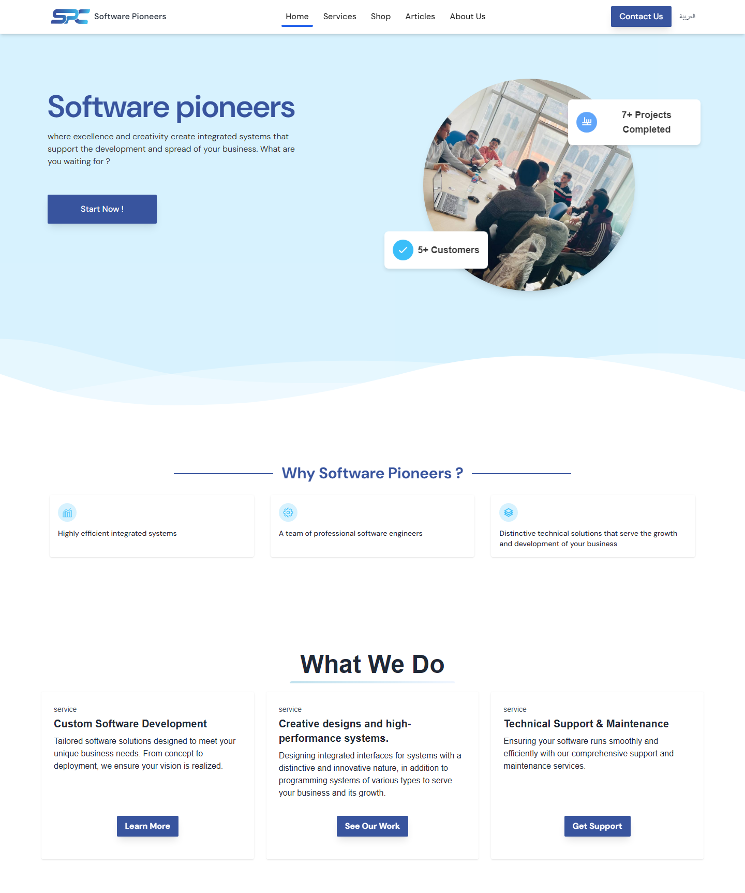

## Overview

This project marks my first venture into using the SvelteKit framework, combined with Tailwind CSS, to create a dynamic website for a creative agency. The site covers the company's diverse offerings, including graphic design, UI/UX design, technical translations, and mobile development.

## production Version
[Check It Out](https://software-pioneers-y7p3-ypox76hr1-salah-2d098c8c.vercel.app/)

## Key Features

- **Home Page**: A visually engaging design with animations that introduce the company, its services, and customer testimonials.
- **Services Page**: Highlights the agency's work, featuring an extensive portfolio showcasing previous projects.
- **Shop Page**: Promotes a partner company's AI article writer plugin with an interactive in-page modal for users to test.
- **Articles Page**: Displays articles with category-based filtering and subtle animations for a smooth user experience.
- **About Us Page**: Shares the company's success story, achievements, and introduces the management team, along with a "Join Our Team" form.
- **Contact Us Page**: Features a contact form linked to a Telegram bot, ensuring instant notifications of new messages.

## Technologies Used

- **Framework**: SvelteKit
- **Styling**: Tailwind CSS
- **Contact**: I used Telegram bots to deliver messages

---

This project highlights my ability to leverage SvelteKit and Tailwind CSS for building a visually appealing and functional website tailored to a creative agency's needs.
